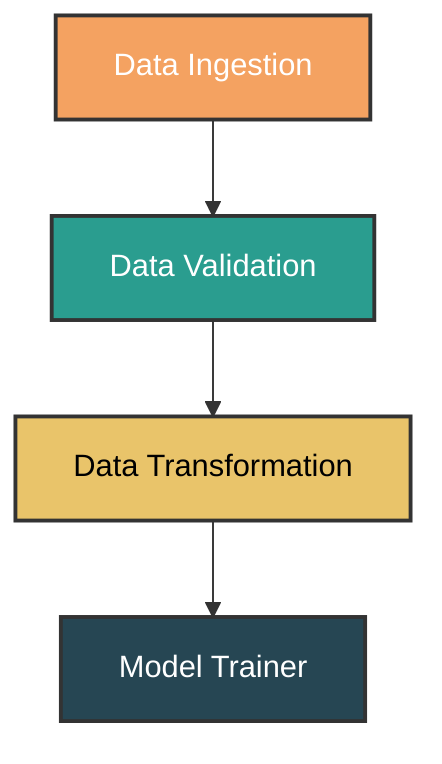

```
ML Project Template
This repository provides a complete machine learning project template with a modular codebase, 
configuration-driven design, and built-in support for Docker, CI/CD, and web interfaces.
```
```text
📁 Project Structure

 
.
├── app.py                 # Web or API interface (e.g., FastAPI/Flask)
├── main.py                # Entry point for running the ML pipeline
├── setup.py               # Packaging and installation
├── requirements.txt       # Python dependencies
├── Dockerfile             # Docker container setup
├── LICENSE                # MIT License for open-source use
├── README.md              # Project overview and instructions
├── params.yaml            # Hyperparameters/config for ML experiments
├── schema.yaml            # Data schema definitions
├── test.py                # Test script (currently empty)
│
├── .github/               # GitHub Actions workflows for CI/CD
│
├── config/
│   └── config.yaml        # Application configuration
│
├── logs/
│   └── running_logs.log   # Execution logs
│
├── research/
│   └── trials.ipynb       # Jupyter notebooks for experimentation
│
├── templates/
│   └── index.html         # Web interface templates
│
└── src/
    └── mlProject/
        ├── __init__.py           # Package initializer + logging setup
        ├── components/           # ML pipeline components
        ├── config/               # Configuration management (e.g., configuration.py)
        ├── constants/            # Project-wide constants
        ├── entity/               # Data and config entity definitions
        ├── pipeline/             # ML pipeline orchestration
        ├── utils/                # Utility functions (e.g., common.py)
        └── template.py           # Script to auto-generate project structure


## Workflows

1. Update config.yaml    # Stores configuration details for your project, such as paths, settings, or environment variables.
2. Update schema.yaml
3. Update params.yaml
4. Update the entity # return type of a function
5. Update the configuration manager in src config
6. Update the components
7. Update the pipeline 
8. Update the main.py
9. Update the app.py
```
## Machine Learning Pipeline


